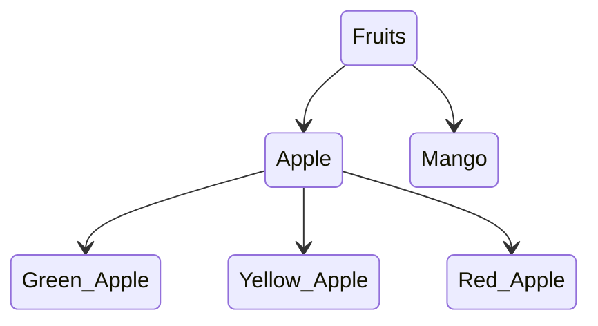
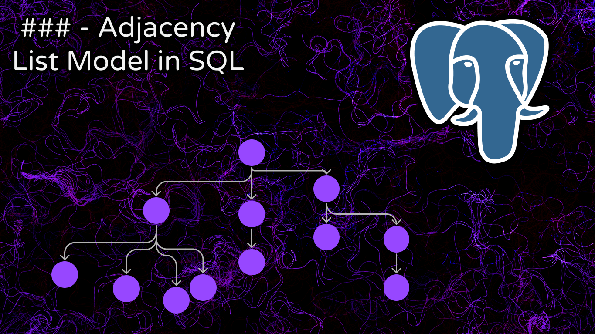

# Adjacency List Model in SQL (youtube code)

The tree from the videos:

- [Starting video](https://youtu.be/W332cnHKhaw?si=RbpYWjLJC_btHmmx)
- 🐾 Adjacency List Model in SQL 🐾 [Playlist](https://youtube.com/playlist?list=PLM0LBHjz37LWA1cecQiIJd14NPXPLpmdK&si=hXLrPXIiJX4gLxqA)
- 🐉 Nested sets trees 🐉 [Playlist](https://youtube.com/playlist?list=PLM0LBHjz37LUgOrslWOJ2RcIJvWtxKIIz)
- 🔱 Graphs & trees 🔱 [Playlist](https://youtube.com/playlist?list=PLM0LBHjz37LVCh8zn3vH5xMobpTS7mhmY)
- [code](./postgresql_code/)
- https://github.com/Rowadz/nested-sets-trees-model-yt
