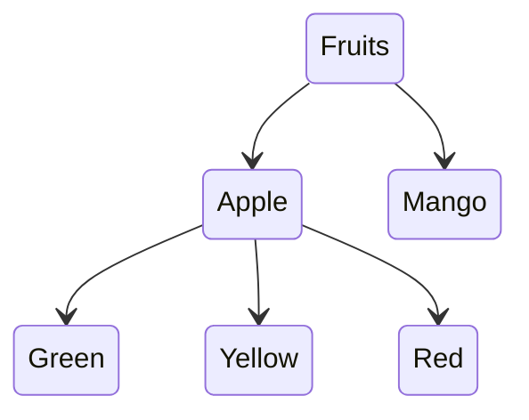

The tree from the videos:

Here you can find the SQL code for the nested sets model written in PostgreSQL `13.3-1.pgdg100+1`

# SQL queries:

- [Create catogires table](./01-create-table.sql)
- [Create nodes](./02-create-nodes.sql)
- [Find the root node](./03-finding-root-node.sql)
- [Finding the immediate children of a node](./04-finding-the-immediate-children-of-a-node.sql)
- [Find how many immediate children a node has](./05-find-how-many-immediate-children-a-node-has.sql)
- [Finding the leaf nodes with a sub query](./06-finding-the-leaf-nodes-sub-query.sql)
- [Finding the leaf nodes with a left join](./07-finding-the-leaf-nodes-left-join.sql)
- [Find the full path](./08-find-full-path.sql)
- [Find the full path as a list with depth or level](./09-find-full-path-as-list-with-depth.sql)
- [Find the full path from a node down](./10-query-a-sub-tree-top-bttom.sql)
- [Find the full path from a node up](./11-query-a-sub-tree-bottom-up.sql)
