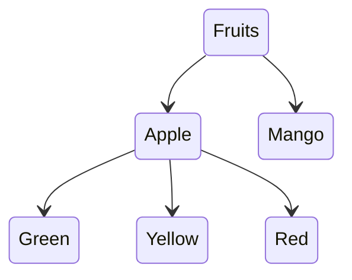

The tree from the videos:

```mermaid
stateDiagram-v2
    Fruits --> Apple
    Fruits --> Mango
    Apple --> Green Apple
    Apple --> Yellow Apple
    Apple --> Red Apple
```

Here you can find the SQL code for the nested sets model written in PostgreSQL `13.3-1.pgdg100+1`

# SQL queries:
